# Angry Birds - ClonyDoves

Clon de Angry Birds hecho con [p5.js](https://p5js.org/) y [Matter.js](https://brm.io/matter-js/) para el motor de físicas. Corre completamente en el navegador, sin necesidad de instalar nada.

<p align="center">
  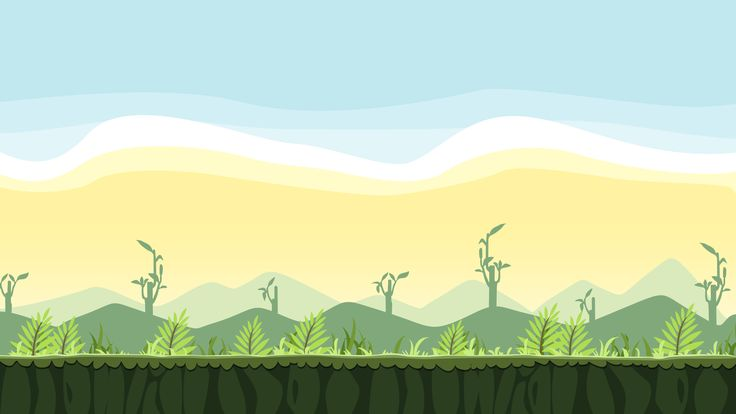
</p>

## Cómo jugar

1. Abrí `index.html` en el navegador (o serví la carpeta con un servidor local, ver más abajo).
2. En la pantalla de inicio, presioná **Iniciar Juego**. Desde ahí también podés entrar a **Medallas** o **Aves y Poderes** para ver cómo se consigue cada una, y silenciar/activar la música con el botón de parlante.
3. Arrastrá el ave hacia atrás en la resortera 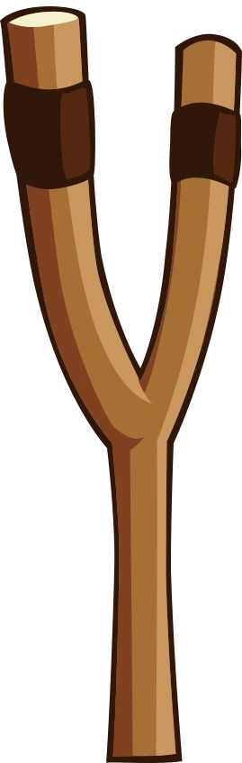 y soltala para lanzarla.
4. Mientras el ave está en pleno vuelo, presioná **espacio** o hacé **click** en la pantalla para activar su poder especial (una sola vez por tiro).
5. Podés elegir qué ave lanzar a continuación haciendo click sobre ella en la cola de espera, en cualquier momento salvo mientras estás apuntando.
6. Derribá la estructura y matá a todos los cerdos para ganar. Perdés si te quedás sin aves (lanzadas, en cola o en vuelo) y todavía queda algún cerdo vivo.
7. Al terminar, la pantalla de resultado muestra tu puntaje y, si ganaste, la medalla correspondiente (bronce, plata u oro según qué tan bien jugaste).

## Cómo correrlo localmente

Es un proyecto 100% estático (HTML + JS), así que solo necesita un servidor local simple:

```bash
python -m http.server 8080
```

Y abrir `http://localhost:8080/index.html` en el navegador.

## Estructura del proyecto

```
index.html         Punto de entrada, carga p5.js, matter.js y todos los scripts
AngryBirds.js       Sketch principal: setup(), draw(), estados del juego (menú, info,
                    jugando, pausa, fin de ronda), nivel, puntaje, poderes, cámara/escala
                    responsive, música y audio
Animal.js           Clase base para aves y cerdos (cuerpo físico circular + render)
Bird.js             Ave jugable (tipo/poder, rastro de movimiento al volar)
Pig.js              Cerdo enemigo (vida, sprites por daño, sonidos)
Box.js              Bloques de la estructura (vida, sprites por daño, lifetime)
Ground.js           Suelo del nivel (extiende Box, cuerpo estático)
Slingshot.js        Resortera (textura, bandas, forro de cuero, sonido de estiramiento)
Explosion.js        Efecto visual de explosión (cerdos, bombas, huevo de Matilda)
images/             Sprites, fondo, medallas e íconos de poderes
audios/             Música y efectos de sonido
libraries/          p5.js y matter.js vendorizados
```

## Características

- **Nivel diseñado a mano**: pirámide de bloques de madera con cerdos escondidos dentro.
- **Cerdos y bloques con vida**: cambian de sprite según el daño recibido y se destruyen al llegar a 0 de vida.
- **5 aves jugables, cada una con su poder**, activable con espacio o click mientras vuela (ver detalle abajo).
- **Selección de ave**: se puede elegir cuál ave lanzar a continuación haciendo click sobre ella en la cola, en cualquier momento salvo mientras se está apuntando.
- **Puntaje y popups**: cada caja y cada cerdo destruidos suman puntos fijos, mostrados al instante como un popup verde flotante sobre el objeto.
- **Condiciones de victoria/derrota**: se gana al matar a todos los cerdos (el fin de ronda se demora un par de segundos por si alguna caja todavía se está terminando de romper) y se pierde si no quedan aves con cerdos vivos.
- **Medallas**: bronce, plata u oro al ganar, según el puntaje final (ver detalle abajo).
- **Pantalla de información**: accesible desde el menú, con dos pestañas — una explica cómo se consigue cada medalla, la otra describe el poder de cada ave.
- **Música y audio**: tema musical en el menú/pantallas de información (se pausa al jugar), con botón de silenciar/activar tanto en el menú como en el juego.
- **Lifetime de seguridad**: los objetos ya no están encerrados por muros invisibles, así que pueden salir de la pantalla y volver con su propia trayectoria; si un cerdo o bloque queda fuera del área jugable y no vuelve en unos segundos, se limpia automáticamente.
- **Pantalla completa y responsive**: el canvas ocupa toda la ventana y se reajusta si la cambiás de tamaño, sin tocar la física del nivel (que vive en una resolución lógica fija).
- **Menú inicial y pausa**: pantalla de bienvenida con botón para iniciar, y pantalla de pausa con reintentar/volver al menú.

### Aves y poderes

<p align="center">
  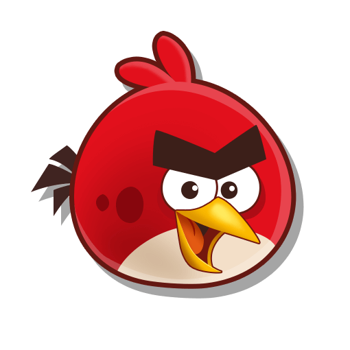
  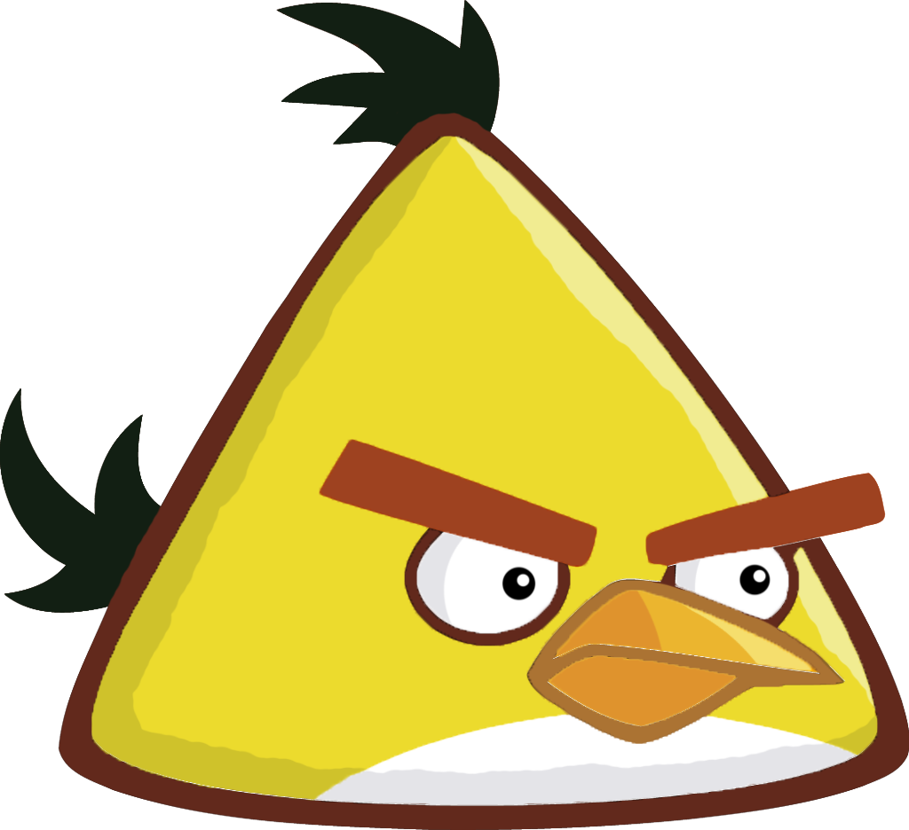
  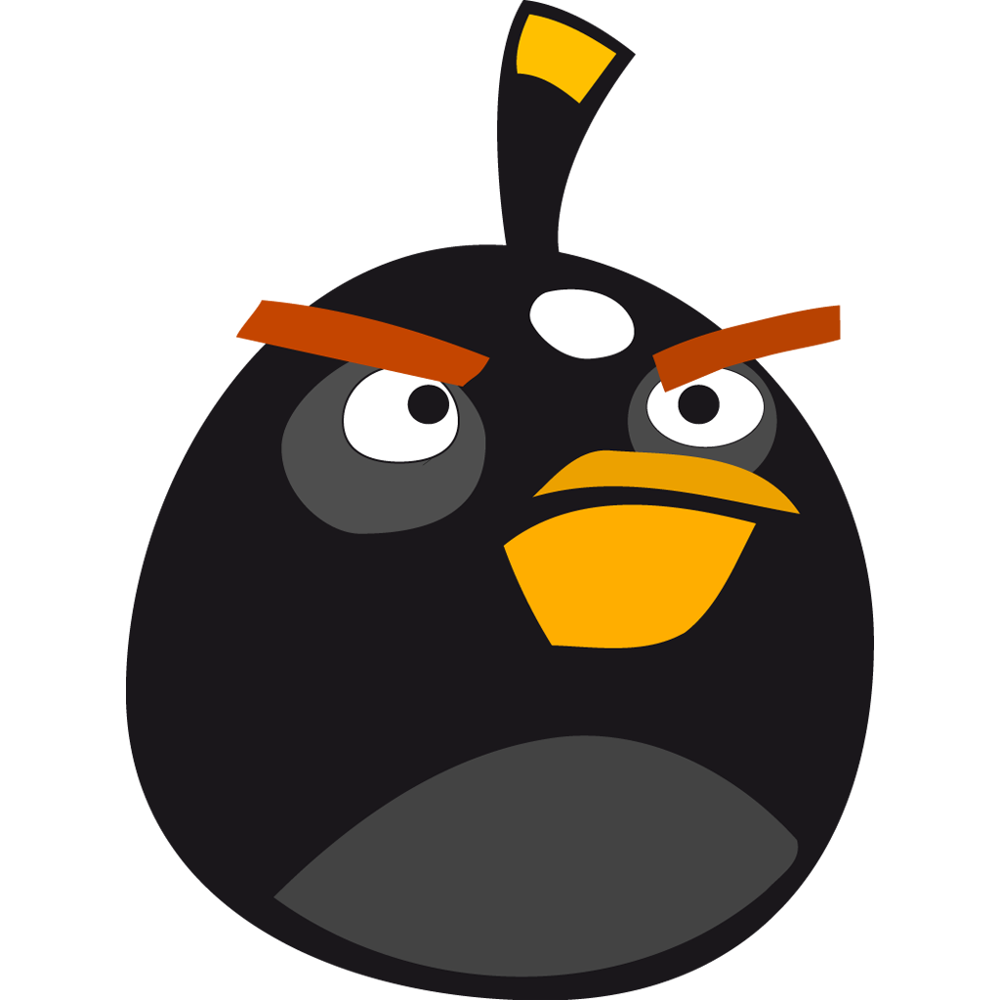
  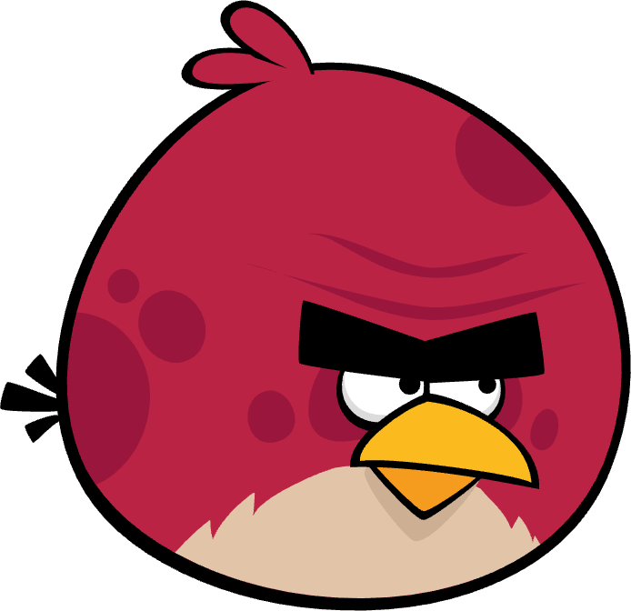
  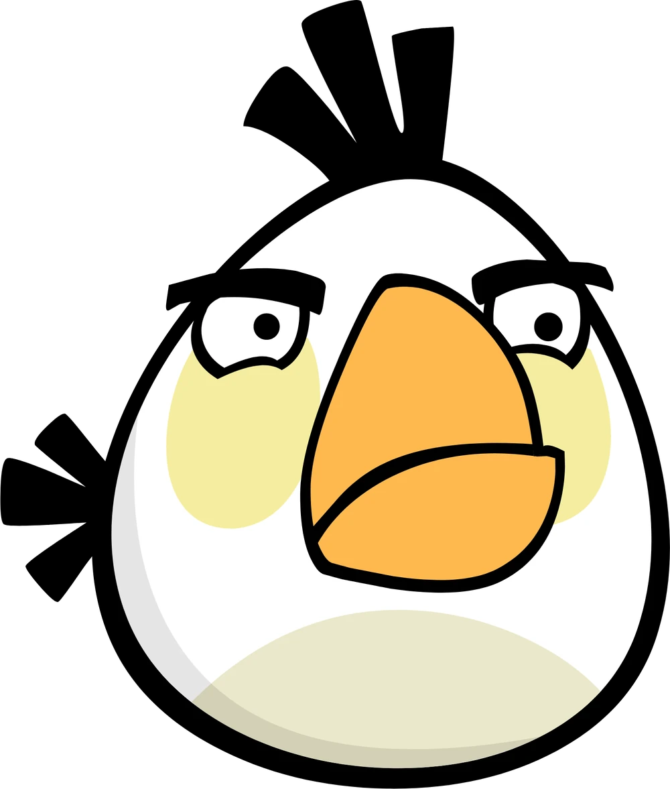
</p>

- **Red**: dispara una onda que empuja y daña todo en la dirección en la que va volando. 
- **Chuck**: acelera de golpe y aplana su trayectoria casi en línea recta.
- **Bomb**: estalla en el acto, dañando y empujando todo lo que tenga cerca. 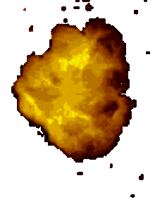
- **OldTerence**: sin poder activable, pero pega más duro por ser más pesada que el resto.
- **Matilda**: suelta un huevo explosivo que detona al tocar el suelo o chocar contra la estructura. 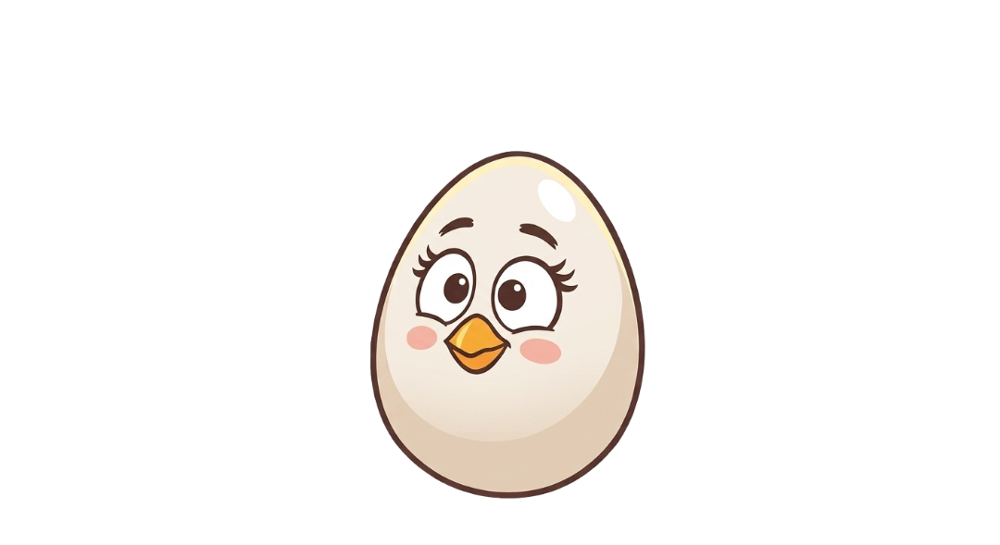

### Medallas

<p align="center">
  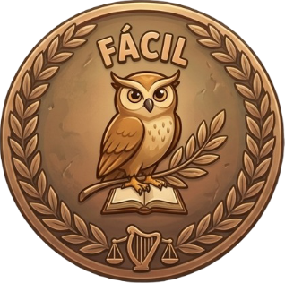
  
  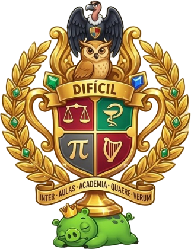
</p>

Se otorgan al ganar la ronda (matar a todos los cerdos), según el puntaje final que hayas acumulado.

## Tecnologías

- [p5.js](https://p5js.org/) — renderizado y bucle de juego
- [Matter.js](https://brm.io/matter-js/) — motor de físicas 2D
